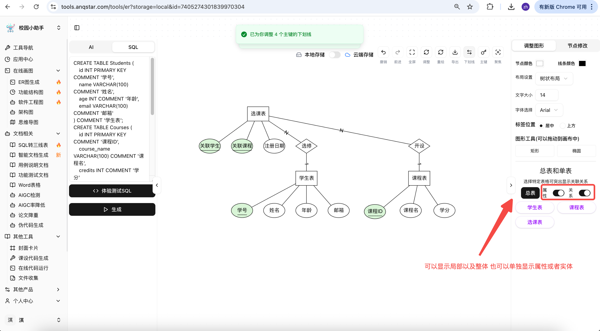
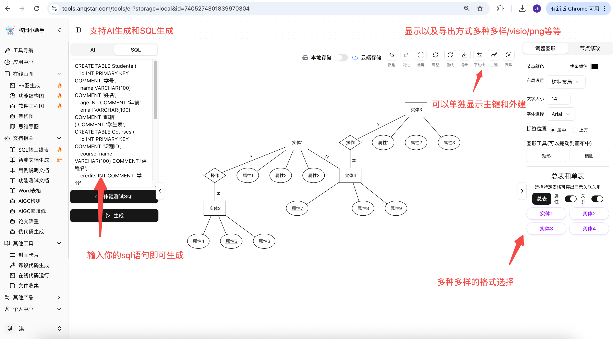
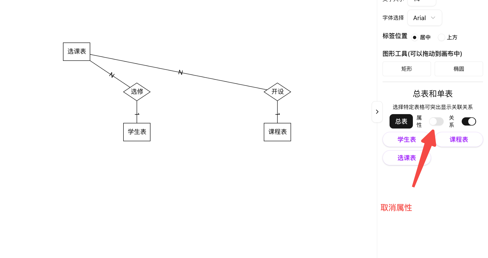
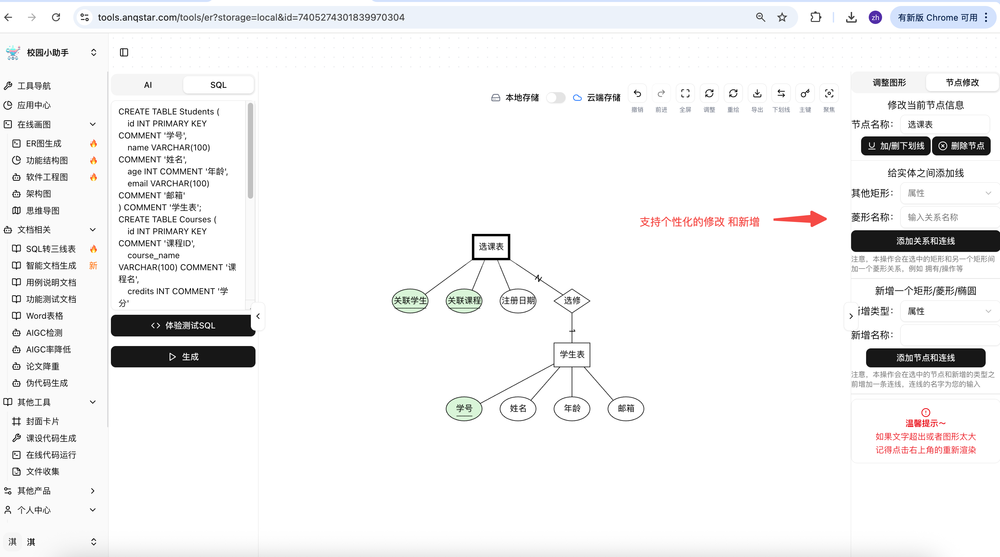
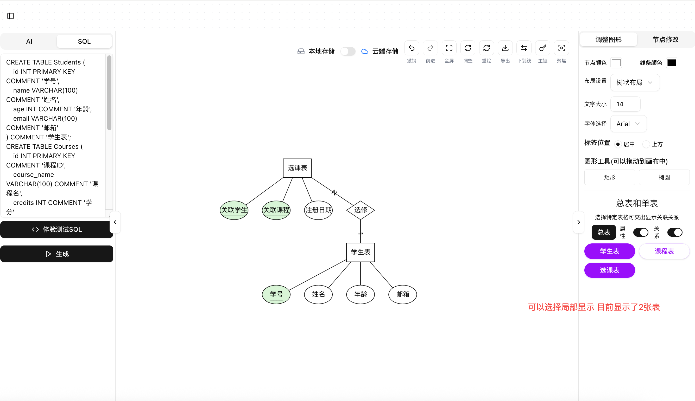
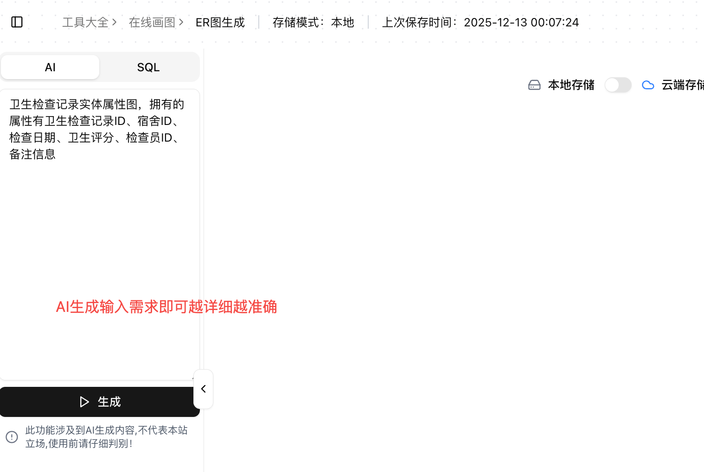
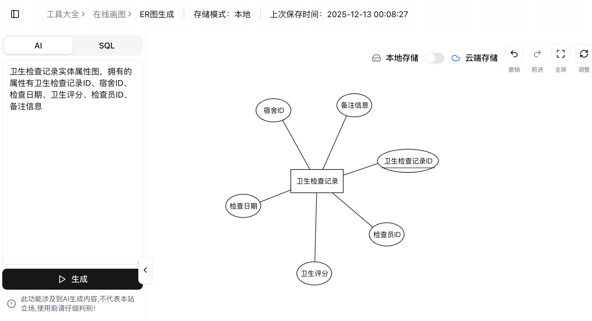

# SQL-to-ER

<div align="center">

[**🇨🇳 中文**](./README.md) | [**🇺🇸 English**](./README_EN.md)

---

**🎉 Open Source & Free ER Diagram Generator 🎉**

SQL to ER Diagram | AI-Powered ER Generation


---

### 🔥 Online Demo

<table align="center">
  <tr>
    <td align="center" width="50%">
      <a href="https://tools.anqstar.com/" target="_blank">
        
      </a>
      <br/>
      <sub><b>Free to Use | Full Features</b></sub>
    </td>
    <td align="center" width="50%">
      <a href="https://draw.anqstar.com/" target="_blank">
        
      </a>
      <br/>
      <sub><b>Advanced Features | Enhanced Experience</b></sub>
    </td>
  </tr>
</table>

</div>

---

## 📖 Introduction

**SQL-to-ER** is a completely open-source and free ER (Entity-Relationship) diagram generator that helps developers quickly and conveniently create and visualize database designs.

### ✨ Key Features

- **🚀 SQL to ER Diagram**: Paste your SQL CREATE TABLE statements to automatically parse and generate professional ER diagrams
- **🤖 AI-Powered Generation**: Describe your requirements in natural language, AI automatically generates ER diagrams that match business logic
- **💰 Completely Free**: 100% open-source and free, no usage restrictions
- **🎨 Visual Editing**: Intuitive graphical interface with drag-and-drop and custom layouts
- **📥 Multiple Export Formats**: Export to images, PDF, and other formats
- **⚡ Ready to Use**: No complex configuration required, works out of the box

---

## 🎯 Features

### 1️⃣ SQL to ER Diagram

Paste your SQL CREATE TABLE statements into the tool, and the system will automatically parse table structures, field types, primary keys, foreign keys, and generate clear ER diagrams.



**Supported Features:**
- ✅ Auto-detect table names, field names, and data types
- ✅ Parse primary keys and foreign keys
- ✅ Display relationships between tables
- ✅ Support multiple SQL dialects (MySQL, PostgreSQL, Oracle, etc.)

---

### 2️⃣ AI-Generated ER Diagram

Simply describe your business requirements in natural language, and AI will intelligently analyze and generate reasonable database designs and ER diagrams.



**AI Intelligence:**
- 🧠 Understand business scenarios described in natural language
- 🧠 Automatically design table structures and fields
- 🧠 Intelligently infer relationships between tables
- 🧠 Follow database design best practices

---

## 📸 Screenshots

<table>
  <tr>
    <td></td>
    <td></td>
  </tr>
  <tr>
    <td></td>
    <td></td>
  </tr>
  <tr>
    <td colspan="2" align="center"></td>
  </tr>
</table>

---

## 🚀 Quick Start

### Requirements

- Java 17+
- Maven 3.6+

### Installation

```bash
# Clone the repository
git clone https://github.com/yourusername/SQL-to-ER.git

# Navigate to project directory
cd SQL-to-ER

# Build the project
mvn clean install

# Run the project
mvn spring-boot:run
```

Visit `http://localhost:8080` to use the application.

### API Endpoints

#### SQL to ER Diagram

```bash
POST /api/sql/parse
Content-Type: application/json

{
  "sql": "CREATE TABLE user (id BIGINT PRIMARY KEY, name VARCHAR(50));",
  "diagramName": "My Database",
  "databaseType": "MySQL"
}
```

#### AI Generation

```bash
POST /api/ai/generate
Content-Type: application/json

{
  "description": "Create an e-commerce system with user, order, and product tables",
  "diagramName": "E-commerce System",
  "language": "en-US"
}
```

---

## 💡 Use Cases

- 📊 **Database Design**: Quickly design and visualize database structures
- 📝 **Documentation Generation**: Generate visual documentation for existing databases
- 👥 **Team Collaboration**: Communicate database designs with teams through graphical representations
- 🎓 **Teaching & Demonstration**: Use for database course teaching and demonstrations
- 🔄 **Reverse Engineering**: Quickly understand database structures from SQL scripts

---

## 📁 Project Structure

```
SQL-to-ER/
├── src/main/java/com/example/sqltoer/
│   ├── controller/          # REST Controllers
│   ├── service/             # Business Logic
│   ├── model/               # Data Models
│   ├── dto/                 # Data Transfer Objects
│   ├── config/              # Configuration
│   ├── util/                # Utilities
│   └── exception/           # Exception Handling
├── src/main/resources/
│   └── application.properties
├── public/                  # Screenshots
├── pom.xml
└── README.md
```

---

## 🛠️ Tech Stack

- **Backend**: Spring Boot 4.0, Java 17
- **Build Tool**: Maven
- **Logging**: SLF4J + Logback
- **Libraries**: Lombok, Jackson

---

## 🤝 Contributing

Contributions of all forms are welcome! Whether it's reporting bugs, suggesting new features, or submitting code improvements.

1. Fork the repository
2. Create your feature branch (`git checkout -b feature/AmazingFeature`)
3. Commit your changes (`git commit -m 'Add some AmazingFeature'`)
4. Push to the branch (`git push origin feature/AmazingFeature`)
5. Open a Pull Request

---

## 📄 License

This project is licensed under the MIT License - see the [LICENSE](LICENSE) file for details.

---

## 🌟 Support

If this project helps you, please give it a ⭐️ Star, which is the greatest encouragement to us!

---

## 📧 Contact

For questions or suggestions, feel free to contact us through:

- 📮 Submit an Issue
- 📧 Send an Email
- 💬 Join Discussions

---

## 🙏 Acknowledgments

Thanks to all the developers who contributed to this project!

---

<div align="center">

**Making Database Design Easier with Open Source!**

Made with ❤️ by SQL-to-ER Team

</div>
